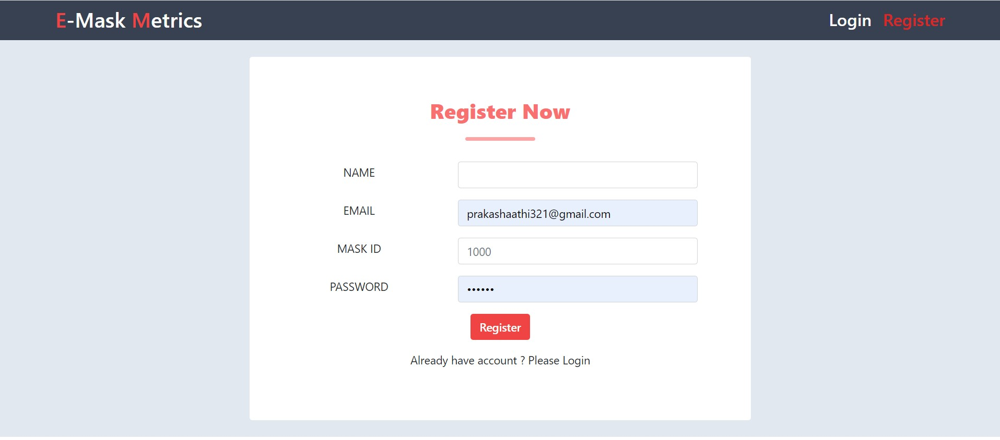
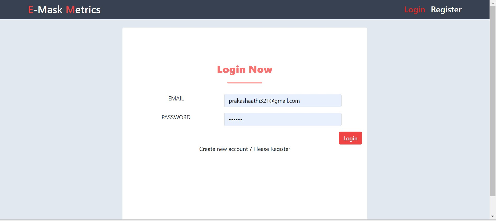
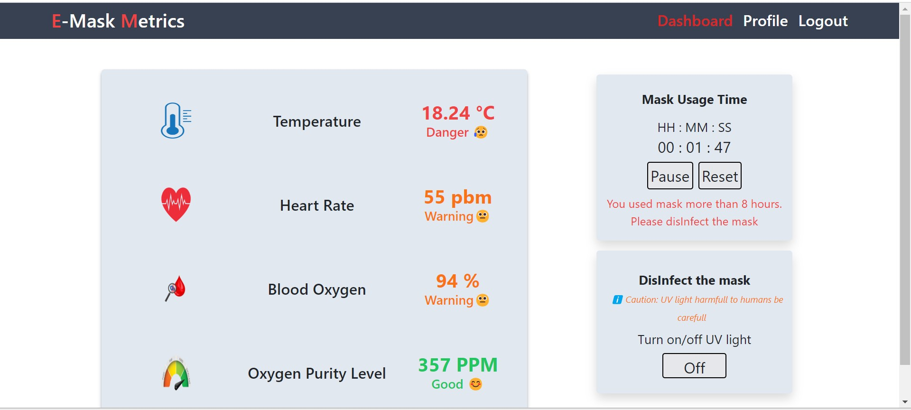
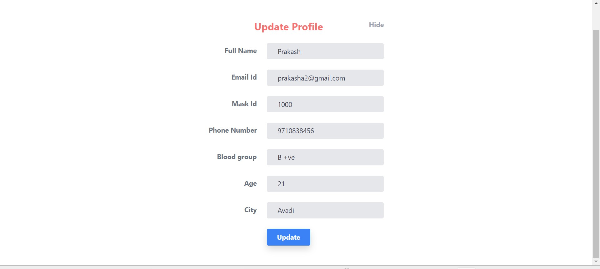
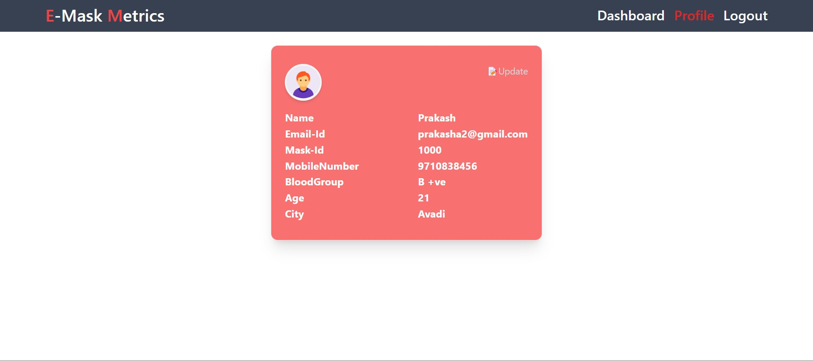

# E-Mask-Metric
This project aims to create a hospital reusable mask equipped with health monitoring biosensors, including a Resistance Temperature Detector (RTD), a Pulse oximeter, and an MQ-135 gas sensor. The software component of the project was developed using React, a component-based JavaScript library, and Firebase authentication and session management.

## Features
- Integration of RTD, pulse oximeter, and MQ-135 gas sensor to monitor health parameters and environmental conditions
- Real-time health monitoring and alerts via web application and email
- User-friendly web application developed using React, including React routers, states, and hooks
- Firebase authentication and session management for secure access to user data

## Getting Started
To use the application, you will need to:

- Clone the repository to your local machine
```
git clone https://github.com/prakash-aathi/E-Mask-Metric.git
```
- Create a account in firebase Real time Database and place the api Key in code 
- Install the necessary dependencies using npm install
- Run the application using npm start

## live and preview 

- Live [https://prakash-aathi.github.io/E-Mask-Metrics/]
- Note : In live dashboard value readings are static ! when the hardware kit powered up the values are show up.







## Contributing
Contributions to the project are welcome and encouraged! If you are interested in contributing, please follow the standard GitHub workflow by forking the repository, creating a branch for your changes, making your changes, and submitting a pull request.

## License
This project is licensed under the MIT License. See the LICENSE file for more information.

